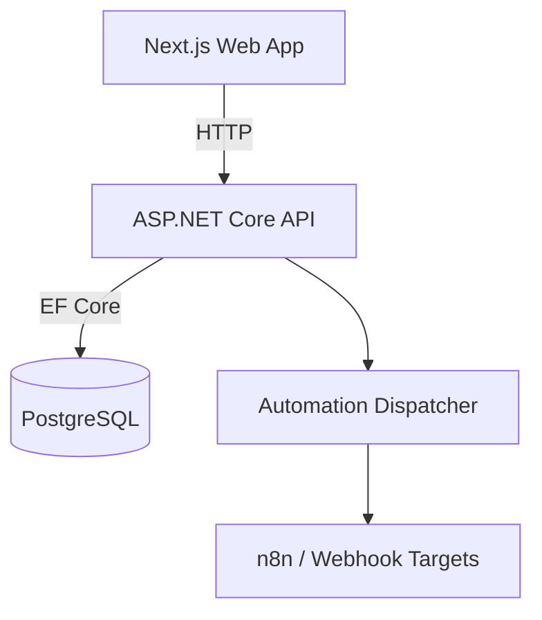

# Aureli Leads

Aureli Leads is a production-minded lead management and automation system built as a full-stack monorepo. It includes authentication, lead scoring, activity timelines, webhook automations, and admin tooling with an emphasis on clean architecture and pragmatic delivery.

## Features
- [x] Auth (JWT stored in httpOnly cookies)
- [x] Leads list + detail views
- [x] Lead scoring with reasons
- [x] Automation events + retries
- [x] Activity timeline with notes
- [x] Webhook settings + test delivery
- [x] Admin user management
- [x] API hardening (validation, rate limiting, correlation IDs)

## Tech Stack
- Backend: ASP.NET Core Web API (.NET 8), C#
- ORM: Entity Framework Core
- Database: PostgreSQL
- Auth: JWT in httpOnly cookies
- Frontend: Next.js (App Router) + TypeScript
- Styling: Tailwind CSS + shadcn/ui
- Containers: Docker + docker-compose

## Architecture Overview


For more detail, see `docs/architecture.md`.

## Local Setup (Docker)
```bash
docker compose up --build
```

API and web will start with demo data when running in Development.

## Demo Credentials
| Role | Email | Password |
| --- | --- | --- |
| Admin | admin@local.test | Admin123! |
| Agent | agent@local.test | Agent123! |
| ReadOnly | readonly@local.test | Readonly123! |

## API Base URLs and Ports
- Web: http://localhost:3000
- API: http://localhost:8080
- Swagger: http://localhost:8080/swagger

## Webhooks (n8n Integration)
1. Create an n8n Webhook node and copy its URL.
2. Go to Settings in the app and set `Webhook Target URL`.
3. Optionally set a secret to include in `X-Aureli-Secret`.
4. Click “Send Test Webhook” to verify delivery.

## Screenshots
- docs/screenshots/leads.png
- docs/screenshots/lead-detail.png
- docs/screenshots/automations.png
- docs/screenshots/settings.png
- docs/screenshots/users.png

## Notes
- Update `Jwt__Key` and database credentials for production.
- Demo seeding runs only in Development.
